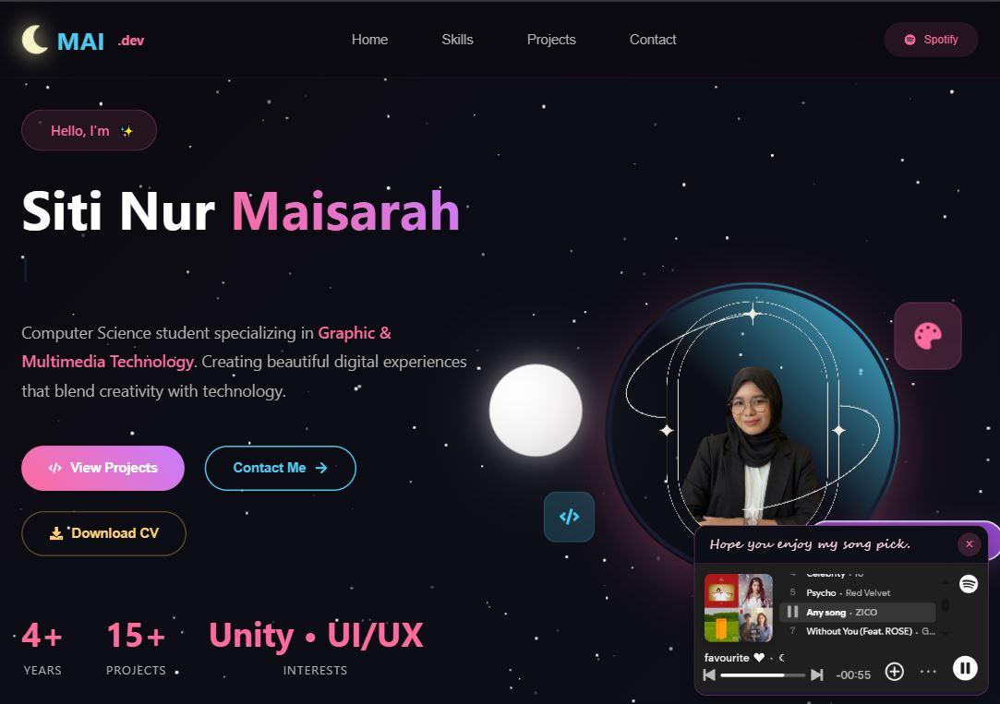

# 🌙 Mai's Portfolio - Siti Nur Maisarah

Welcome to my personal portfolio website! I'm Siti Nur Maisarah, a passionate Computer Science student specializing in Graphic & Multimedia Technology. This interactive portfolio showcases my journey in game development, web applications, and multimedia projects.



## ✨ Features

- **Interactive Design**: Smooth animations, floating elements, and hover effects
- **Mobile-Friendly**: Fully responsive with touch-friendly interactions
- **Dark Night Theme**: Beautiful starry background with animated moon
- **Project Showcase**: Detailed case studies of my academic and personal projects
- **Skills Visualization**: Animated skill bars and technology icons
- **Contact Integration**: Direct links to social media and contact forms

## 🎨 Design Theme

Inspired by a **strawberry matcha** aesthetic with:
- Pink accents (strawberry)
- Green highlights (matcha)
- Night sky background with floating moon
- iOS-style emoji decorations

## 🚀 Technologies Used

### Frontend
- **React** - Component-based UI framework
- **JavaScript (ES6+)** - Modern JavaScript features
- **CSS3** - Custom animations and responsive design
- **HTML5** - Semantic markup

### Development Tools
- **Create React App** - React application boilerplate
- **Git** - Version control
- **VS Code** - Code editor

### Game Development (Featured Projects)
- **Unity** - Game engine for 2D/3D games
- **C#** - Scripting language
- **VR Development** - Oculus SDK integration

## 🎮 Featured Projects

### 1. MY-HYGIENE: Educational Game
Interactive 2D educational game teaching personal hygiene through real-time image processing and gamification.

**Tech Stack**: Unity, C#, Image Processing, Mediapipe

### 2. AEGIS: Escape Protocol
3D action-adventure game with interactive maps, AI enemies, and custom gameplay systems.

**Tech Stack**: Unity 3D, C#, AI Programming, Game Design

### 3. E-Blood Donation System
Web-based platform for blood donor registration and donation management.

**Tech Stack**: PHP, MySQL, HTML/CSS, JavaScript

### 4. Language Learning VR App
Immersive VR application for language learning with object interaction.

**Tech Stack**: Unity, VR Development, C#, Oculus SDK

## 🛠️ Installation & Setup

1. **Clone the repository**
   ```bash
   git clone https://github.com/maisiyy/Mai-Portfolio.git
   cd mai-portfolio-react
   ```

2. **Install dependencies**
   ```bash
   npm install
   ```

3. **Start development server**
   ```bash
   npm start
   ```

4. **Open in browser**
   Navigate to [http://localhost:3000](http://localhost:3000)

## 📱 Usage

- **Navigation**: Use the header menu or scroll through sections
- **Projects**: Click on project cards to view details
- **Contact**: Fill out the contact form or use social links
- **Mobile**: All interactions work seamlessly on touch devices

## 🎯 Skills & Expertise

- **Game Development**: Unity, C#, Game Design
- **Web Development**: React, JavaScript, CSS, PHP
- **Multimedia**: Graphic Design, VR Development, Image Processing
- **Tools**: Git, Figma, Adobe Creative Suite

## 📞 Contact

- **Email**: maisarahmzn@gmail.com
- **LinkedIn**: [Your LinkedIn Profile]
- **GitHub**: [https://github.com/maisiyy](https://github.com/maisiyy)
- **Location**: Kelantan, Malaysia

## 📄 License

This project is open source and available under the [MIT License](LICENSE).

---

*Built with ❤️ by Siti Nur Maisarah*

### Analyzing the Bundle Size

This section has moved here: [https://facebook.github.io/create-react-app/docs/analyzing-the-bundle-size](https://facebook.github.io/create-react-app/docs/analyzing-the-bundle-size)

### Making a Progressive Web App

This section has moved here: [https://facebook.github.io/create-react-app/docs/making-a-progressive-web-app](https://facebook.github.io/create-react-app/docs/making-a-progressive-web-app)

### Advanced Configuration

This section has moved here: [https://facebook.github.io/create-react-app/docs/advanced-configuration](https://facebook.github.io/create-react-app/docs/advanced-configuration)

### Deployment

This section has moved here: [https://facebook.github.io/create-react-app/docs/deployment](https://facebook.github.io/create-react-app/docs/deployment)

### `npm run build` fails to minify

This section has moved here: [https://facebook.github.io/create-react-app/docs/troubleshooting#npm-run-build-fails-to-minify](https://facebook.github.io/create-react-app/docs/troubleshooting#npm-run-build-fails-to-minify)
